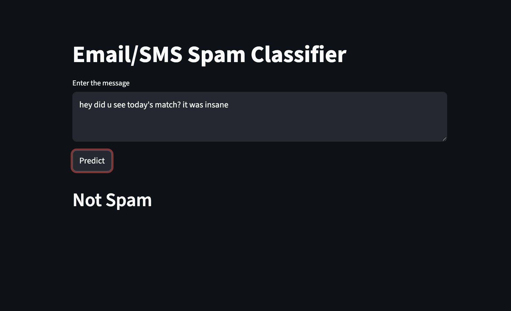

# 📧 Email/SMS Spam Classifier

An end-to-end Machine Learning web application that classifies messages as **Spam** or **Not Spam/Ham** (Legitimate) with high precision. This project covers the entire pipeline from raw data exploration to cloud deployment.

## 🚀 Live Demo
[https://suvali-spam-detector.streamlit.app/]




## 🛠️ Tech Stack
* **Language:** Python
* **ML Libraries:** Pandas, Scikit-learn, NLTK
* **Algorithm:** Multinomial Naive Bayes
* **Web Framework:** Streamlit

## 📊 Project Workflow

### 1. Data Collection & Cleaning
* Sourced the dataset from **Kaggle**.
* Handled missing values and removed duplicate entries.
* Performed **Label Encoding** on the target variable.

### 2. Exploratory Data Analysis (EDA)
* Analyzed the distribution of Spam vs. Ham messages.
* Calculated the number of characters, words, and sentences for each message to find patterns.

### 3. Text Preprocessing (NLP)
* **Tokenization:** Breaking sentences into individual words.
* **Cleaning:** Removing special characters and stopwords.
* **Stemming:** Reducing words to their root form (e.g., "dancing" to "danc") using PorterStemmer.

### 4. Model Building
* Converted text data into vectors using **TF-IDF Vectorizer**.
* Trained a **Multinomial Naive Bayes** classifier.
* Achieved high **Precision** (crucial for spam detection to avoid misclassifying important emails).

### 5. Deployment
* Built an interactive frontend using **Streamlit**.
* Exported the trained model and vectorizer using `pickle`.

## 📂 Directory Structure
```text
├── app.py                # Streamlit application code
├── model.pkl             # Trained Naive Bayes model
├── vectorizer.pkl        # Saved TF-IDF Vectorizer
├── spam_classifier.ipynb # Full EDA and model training notebook
├── requirements.txt      # Project dependencies
└── README.md
